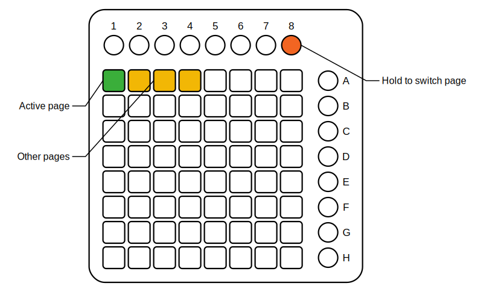

# Base64 (titled BASE64)

*Part of [pages64](../README.md).*

This is the central module. Once loaded, you can select the Launchpad MIDI
interface and attach the "page" modules to its right. The LEDs at the top
indicate the number of modules connected and the currently active module (green)
and inactive ones (yellow). The output jacks at the bottom provide a CV signal
for the currently active page (0V for the first page, 1V for the second, and so
on) and a trigger signal when a page is changed.

To switch to a different page, keep pressed the rightmost button in the top round
button row of the Launchpad (labeled 8), and press a button from the top row of
the grid; each lighted button is a page.

   
  <em>Page selection: hold button 8 and press a lit top-row pad.</em>

Across all page modules the Launchpad's extra buttons follow one convention: the
**top round buttons (1–8)** carry static page configuration (button 8 is always
page select; button 6 is the global snapshot below; 7 is reserved for the
cross-page gesture recorder), while the **scene buttons (A–H)** on the right are
for interactive play — latch modes, mute groups and the like.

## Temp save / temp reload (button 6)

The Elektron trick, for the whole chain: **hold button 6** for about a second —
it flashes green — and every page module (active or not) snapshots its state,
along with the active page. Mangle everything live; **tap button 6** to snap
back to the saved state. The snapshot lives in memory only: it is not stored
in the patch, and reloading before any save does nothing.
