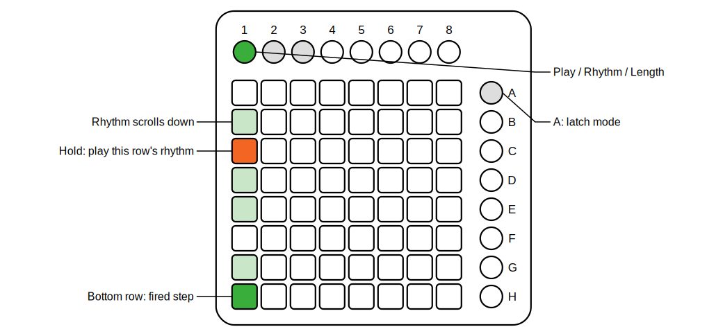

# Cafe64 (titled CAFE64)

*Part of [pages64](../README.md).*

This module is a polyrhythm performance sequencer inspired by [Press Cafe](https://llllllll.co/t/press-cafe) by stretta. It has eight rhythm patterns and eight independent trigger voices. Three sub-pages are selected with the first three top round buttons of the Launchpad:

**Page 1 — Play:** Each column is a voice, each row selects a rhythm pattern. Hold a button to arm that voice: it waits for the next clock tick (for tight sync) then starts playing the chosen pattern. Release the button to stop. While a voice is playing, pressing a different row in the same column switches it to a new pattern immediately. A scrolling display shows the rhythm falling downward in sync with the clock; the bottom row always shows the most recently fired step.

   
  <em>The play page: hold a pad to play that row's rhythm on that column's voice.</em>

**Page 2 — Rhythm editor:** Each column shows one rhythm pattern. The bottom button is step 1, the top button is step 8. Press a button to toggle that step on or off.

**Page 3 — Length editor:** Each column shows the length of its rhythm as a filled bar from the bottom. Press a button to set the length to that row's height (bottom = 1 step, top = 8 steps).

On each clock tick, any active voice checks whether the current step of its pattern is on — if so, it fires a 5 ms trigger on the corresponding output. The pattern loops: if the length is 5, steps play 1 2 3 4 5 1 2 3 4 5 … The three sub-page selector buttons are lit to show which page is active.

**Latch mode:** pressing scene button A switches from momentary (hold) to latch play. In latch mode, a tap arms a column; the pattern keeps playing after you release, even while you navigate to other pages. Tapping the same row again stops that column; tapping a different row changes the pattern immediately. Pressing A again turns latch mode off and stops all voices. The active column's selected row is always shown as a fixed overlay on the scrolling display (latch-on color when that scroll position is a lit step, latch-off color otherwise), so you can see at a glance which rhythm each column is using. In pages 2 and 3, active rhythm columns are also drawn in latch-on color, making it easy to identify and edit playing patterns without switching back to the play page.

The module provides 8 mono trigger outputs (T1–T8) and a polyphonic output carrying all 8 triggers on channels 1–8.

In the right-click menu you can select a **clock divider** (÷1 through ÷64), and choose colors for the **active page button**, **inactive page buttons**, **step indicator**, **latch indicator (on step)**, and **latch indicator (off step)**.
