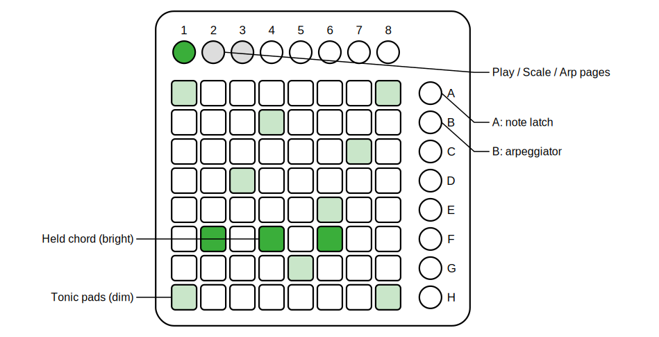

# Keys64 (titled KEYS64)

*Part of [pages64](../README.md).*

This module turns the grid into a playable polyphonic keyboard. Each cell is a
note and pressing it plays it; pitch rises up and to the right, so the
bottom-left pad is the lowest note. Unlike Gome64 or Buttons64 — which emit
gates for a companion to pitch — Keys64 maps to pitch itself and drives a
polyphonic voice directly, no 64Notes required. Notes are momentary by default.

**Layout:** two arrangements share the plugin's scale math.

- **Scale grid** (the default) keeps everything in key: steps to the right are
  scale degrees, and each row up adds a fixed number of degrees (the **row
  degrees** setting, default 3 — a diatonic fourth), so a chord or run has the
  same shape wherever you play it.
- **Isomorphic** uses fixed chromatic intervals instead: a set number of
  semitones per column and per row, for a uniform, every-note layout.

Tonic cells — every pad whose note is the root — are lit dimly so you can
always find home; held pads light bright.

   
  <em>The scale grid: dim tonics mark home, a held chord keeps its shape anywhere.</em>

**Latch (scene A):** notes are momentary, but scene A latches them.

- **Hold A and play** to latch just those notes: they stay sounding after you
  release the pads, while everything else stays momentary.
- **Tap A** (press and release with no note in between) to toggle a global
  latch mode in which *every* press toggles a sustained note on or off.
  Tapping A again leaves latch mode and clears all sustained notes.

Latched notes keep sounding even while you visit another page.

**Arpeggiator (scene B):** tap B to arpeggiate the held/latched notes. On each
clock tick (from Base64, through the clock divider) one note plays, in the
chosen pattern. The right-click **arpeggiator mode** menu — or the Arp page —
offers up, down, up-down, down-up, converge, diverge, as-played (in press
order), alternating-root, random, and random-no-repeat. While the arp runs the
output is monophonic; RESET restarts the sequence.

**Config pages (top buttons):** button **1** is the **Play** page. Button
**2** is the **Scale** page — set the scale, layout, root (a little piano: white
keys on one row, black keys above) and octave directly on the grid. Button
**3** is the **Arp** page — one pad per arpeggiator mode. Available cells show
dim, the current choice bright. Everything here is also in the right-click menu.

**Octave (scene buttons):** the base octave is set on the Scale page and in the
menu.

**Outputs:** **PITCH** (1 V/oct), **GATE** and **RTRG**, polyphonic with as
many channels as the polyphony setting (one channel while the arp runs). Patch
PITCH and GATE into a poly oscillator and envelope, and RTRG into the
envelope's retrigger so stolen or arpeggiated voices re-strike cleanly. Leaving
the page releases all momentary notes, so nothing sticks.

In the right-click menu you also set the **polyphony** (1–16) and **voice
stealing** rule, and the **play / latch / root / arp / page** colors.
