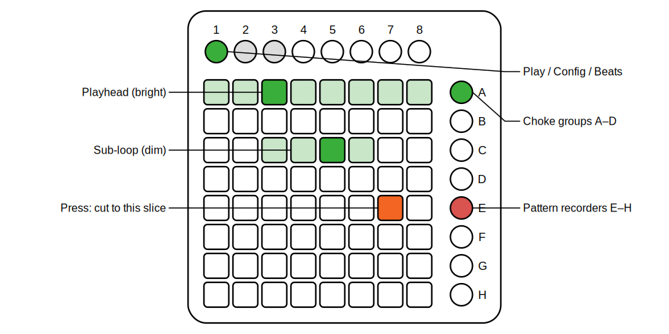

# Mlr64 (titled MLR64)

*Part of [pages64](../README.md).*

This module is a performance sample cutter after [mlr](https://llllllll.co/t/mlr/)
by tehn — the page module that breaks the rule and hosts its own sample
playback, because the instrument's feel depends on it.

Each of the eight grid rows is a **lane** holding one loop, divided into eight
**slices** (columns). Load WAVs from the right-click menu (one entry per lane)
or drop files onto the panel — they fill the first empty lanes. Loaded lanes
sit silent until you press a pad.

   
  <em>The play page: dim loop region, bright playhead; scenes A–D choke, E–H record.</em>

**Playing (top button 1, default):**

- **Jump:** press a pad — the lane's playhead jumps to that slice, quantized
  (menu: off / 1 tick / 2 ticks / 1 beat; default 1 tick). The playhead is the
  bright pad; the loop region is dim.
- **Sub-loop:** hold one pad and press another in the same lane; the lane
  loops between them — and the press order sets the direction: second pad to
  the right plays forward, to the left plays the region **in reverse**. A
  single press returns to the full loop and the lane's default direction
  (a per-lane **Reverse** switch in the context menu and on the config page).
- **Choke groups (scenes A–D):** within a group only one lane plays at a
  time — starting a lane stops whichever lane of that group was running.
  Lanes start out ungrouped. **Tap a silent group** to arm it: the next lane
  you start joins it. **Hold a group and press a pad** to assign that lane and
  start it, choking the current one. **Tap a playing group** to stop it. The
  scene LED is lit while a lane of the group plays, dim while armed.
- **Pattern recorders (scenes E–H):** tap to record — your jumps are captured;
  tap again to close the loop (length rounds up to a whole beat) and it
  replays, through the quantizer, even while you play other pages. Tap to
  mute/unmute, hold about a second to clear.

**Configuration (top buttons 2–3):** button 2 opens the lane page — columns
1–4 show and edit the group (tap the active cell to unassign), columns 6/7
choose loop or one-shot (a one-shot lane waits silently and plays the pressed
slice to the end, once), and column 8 toggles the default direction
(lit = reverse). Button 3 opens
the beats page — each column sets the lane's musical length (1 to 64 beats)
as a bar display.

**Sync:** playback is **varispeed**. Mlr64 measures the Base64 clock's tick
period (a *ticks per beat* menu says what the clock carries; default quarter
notes) and plays each lane so its declared beat-length fits the tempo — a loop
at the wrong BPM simply shifts pitch, like the original. Beats are guessed at
load from `…120bpm….wav`-style filenames or the running clock, and always
editable. Every jump, stop and loop wrap is declicked with a 2 ms crossfade.
RESET re-zeros all lanes and recorders: the "bar 1" button. Prepare cleanly
cut loops; that's the instrument.

Outputs: a stereo **mix** (L/R) and an 8-channel **poly** output with one lane
per channel, for external per-lane processing. The full design rationale lives
in [Mlr64.md](design/Mlr64.md).
